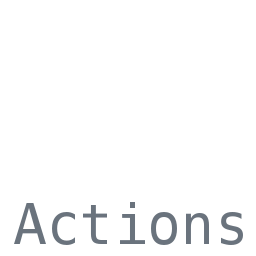

Questions during the presentation?


---

## How we automated<br /> our Angular updates

----

<h2><span class="fragment">(Frontend)</span> World moves fast</h2>

Note: New versions weekly, additional tooling and libraries for your favorite project to keep up with, and your daily new framework. Although, it's been setting now for a bit. It can be distracting!

----

## Where it all began

Note: So, about a year and half ago, I was working in a team and we noticed that almost every sprint we lost some time to just updating our apps. 

----

<svg xmlns="http://www.w3.org/2000/svg" height="400" xmlns:xlink="http://www.w3.org/1999/xlink" version="1.1" id="Layer_1" x="0px" y="0px" viewBox="0 0 250 250" style="enable-background:new 0 0 250 250;" xml:space="preserve">
<style type="text/css">
	.st0{fill:#DD0031;}
	.st1{fill:#C3002F;}
	.st2{fill:#FFFFFF;}
</style>
<g>
	<polygon class="st0" points="125,30 125,30 125,30 31.9,63.2 46.1,186.3 125,230 125,230 125,230 203.9,186.3 218.1,63.2  "/>
	<polygon class="st1" points="125,30 125,52.2 125,52.1 125,153.4 125,153.4 125,230 125,230 203.9,186.3 218.1,63.2 125,30  "/>
	<path class="st2" d="M125,52.1L66.8,182.6h0h21.7h0l11.7-29.2h49.4l11.7,29.2h0h21.7h0L125,52.1L125,52.1L125,52.1L125,52.1   L125,52.1z M142,135.4H108l17-40.9L142,135.4z"/>
</g>
</svg>

Note: We are running Angular in our frontend apps, which was being updated quite often.

----

### Angular CLI

🦸‍♀️ Updates packages<!-- .element: class="fragment" -->

🦸 Runs migration schematics<!-- .element: class="fragment" -->

😁 Keeps us happy!<!-- .element: class="fragment" -->

Note: We use the Angular CLI for most of our upgrades pre-work anyway, automatic migrations and packages get ready. Then we gotta test if everything still works as expected, are there any compilation errors etcetera.

----


# 💡

 Note: So we had an idea. Why not let a bot do that and we review the results?

----

## Blogged about it

https://medium.com/codestar-blog/how-we-automated-our-angular-updates-9790212aa211

Note: So I blogged about our experiences, and what it brought us. And now we are here! This showed a much more complex Jenkins example which we'll review later.

---

<div class="fragment fade-up">
<div style="float: left; width: 50%">
  <br />
  
  
</div>
<div style="float: left; width: 50%; text-align: left;">
<br />
  <h1 style="font-size: 0.9em;">Bjorn Schijff</h1>
  <small style="display: inline-flex;">Sr. Frontend Engineer @ Codestar</small><br />
   <small><svg xmlns="http://www.w3.org/2000/svg" width="24" height="24" viewBox="0 0 24 24" style="fill: #1DA1F2"><path d="M12 0c-6.627 0-12 5.373-12 12s5.373 12 12 12 12-5.373 12-12-5.373-12-12-12zm6.066 9.645c.183 4.04-2.83 8.544-8.164 8.544-1.622 0-3.131-.476-4.402-1.291 1.524.18 3.045-.244 4.252-1.189-1.256-.023-2.317-.854-2.684-1.995.451.086.895.061 1.298-.049-1.381-.278-2.335-1.522-2.304-2.853.388.215.83.344 1.301.359-1.279-.855-1.641-2.544-.889-3.835 1.416 1.738 3.533 2.881 5.92 3.001-.419-1.796.944-3.527 2.799-3.527.825 0 1.572.349 2.096.907.654-.128 1.27-.368 1.824-.697-.215.671-.67 1.233-1.263 1.589.581-.07 1.135-.224 1.649-.453-.384.578-.87 1.084-1.433 1.489z"/></svg> @Bjeaurn</small>
</div>
</div>

Note: Introduce yourself.

---

## Why did we want to automate?

<p class="fragment fade-in-then-semi-out visible" data-fragment-index="0">Take away focus &amp; distracting</p>
<p class="fragment fade-in-then-semi-out visible" data-fragment-index="1">Time consuming</p>
<p class="fragment fade-in-then-semi-out visible" data-fragment-index="2">Cause we can</p>

Note: This can take away focus from the things you want to work on, take precious time out of your day and distract from the things that matter. And we usually just automate what we can.

----

## Keep developers in control

Nothing gets merged automatically<!-- .element: class="fragment fade-in-then-semi-out" -->

The end result is a merge request<!-- .element: class="fragment fade-in-then-semi-out" -->

Check the build, lint and tests<!-- .element: class="fragment fade-in-then-semi-out" -->

Note: We don't want to lose control of the process. We don't want any new (automated) code in our repository without a final say from a developer and an easy way to rollback. We just check the results from the CI and make sure all is right before we even consider merging.

---

## A note about other platforms

What about React? VueJS?<!-- .element: class="fragment fade-in-then-out" -->

<svg viewBox="0 0 336 96" height="200" fill="none" class="fragment"><path d="M3.465 25.727l37.33-24.472a7.67 7.67 0 018.41 0l37.33 24.472A7.67 7.67 0 0190 32.142v31.714a7.67 7.67 0 01-3.465 6.414l-37.33 24.472a7.67 7.67 0 01-8.41 0L3.465 70.27A7.67 7.67 0 010 63.856V32.142a7.67 7.67 0 013.465-6.415z" fill="#0366D6"></path><path d="M114.045 62.658c9.032 0 14.388-5.59 14.388-14.858 0-9.239-5.356-14.8-14.185-14.8H104v29.658h10.045zm-4.675-4.648V37.649h4.574c6.021 0 9.162 3.36 9.162 10.151 0 6.821-3.141 10.21-9.321 10.21h-4.415zM142.614 63.093c5.182 0 8.743-2.534 9.669-6.4l-4.893-.551c-.709 1.882-2.446 2.867-4.704 2.867-3.387 0-5.63-2.23-5.674-6.039H152.5v-1.607c0-7.806-4.69-11.238-10.161-11.238-6.369 0-10.523 4.678-10.523 11.542 0 6.98 4.096 11.426 10.798 11.426zm-5.587-13.656c.159-2.839 2.258-5.228 5.384-5.228 3.011 0 5.037 2.201 5.066 5.228h-10.45zM156.512 71h5.24V59.154h.217c.825 1.622 2.547 3.895 6.369 3.895 5.239 0 9.162-4.156 9.162-11.483 0-7.415-4.038-11.441-9.177-11.441-3.922 0-5.558 2.36-6.354 3.968h-.304v-3.678h-5.153V71zm5.138-19.463c0-4.316 1.853-7.11 5.226-7.11 3.488 0 5.283 2.968 5.283 7.11 0 4.17-1.824 7.212-5.283 7.212-3.344 0-5.226-2.897-5.226-7.212zM191.798 63.093c5.182 0 8.743-2.534 9.669-6.4l-4.892-.551c-.71 1.882-2.447 2.867-4.705 2.867-3.387 0-5.63-2.23-5.674-6.039h15.488v-1.607c0-7.806-4.69-11.238-10.161-11.238-6.369 0-10.523 4.678-10.523 11.542 0 6.98 4.096 11.426 10.798 11.426zm-5.587-13.656c.159-2.839 2.258-5.228 5.384-5.228 3.011 0 5.038 2.201 5.066 5.228h-10.45zM210.342 49.625c0-3.215 1.94-5.069 4.704-5.069 2.707 0 4.328 1.782 4.328 4.75v13.352h5.24V48.495c.014-5.329-3.025-8.37-7.614-8.37-3.329 0-5.616 1.593-6.629 4.07h-.261v-3.78h-5.008v22.243h5.24V49.625zM237.191 63.05c3.821 0 5.544-2.274 6.369-3.896h.318v3.504h5.153V33h-5.254v11.093h-.217c-.796-1.608-2.432-3.968-6.355-3.968-5.138 0-9.176 4.026-9.176 11.44 0 7.328 3.922 11.485 9.162 11.485zm1.462-4.301c-3.46 0-5.283-3.042-5.283-7.212 0-4.142 1.795-7.11 5.283-7.11 3.372 0 5.225 2.794 5.225 7.11 0 4.315-1.881 7.212-5.225 7.212zM259.512 63.108c3.489 0 5.573-1.637 6.528-3.505h.174v3.055h5.037V47.771c0-5.88-4.791-7.646-9.032-7.646-4.675 0-8.265 2.085-9.423 6.14l4.893.695c.521-1.52 1.997-2.824 4.559-2.824 2.432 0 3.764 1.246 3.764 3.433v.087c0 1.506-1.578 1.578-5.501 1.998-4.313.463-8.438 1.752-8.438 6.763 0 4.373 3.198 6.69 7.439 6.69zm1.361-3.853c-2.186 0-3.749-.999-3.749-2.925 0-2.013 1.752-2.853 4.096-3.186 1.376-.188 4.126-.536 4.806-1.086v2.621c0 2.477-1.998 4.576-5.153 4.576zM275.012 62.658h5.153v-3.504h.304c.825 1.622 2.547 3.895 6.369 3.895 5.239 0 9.162-4.156 9.162-11.483 0-7.415-4.038-11.441-9.177-11.441-3.922 0-5.558 2.36-6.354 3.968h-.217V33h-5.24v29.658zm5.138-11.121c0-4.316 1.853-7.11 5.226-7.11 3.488 0 5.283 2.968 5.283 7.11 0 4.17-1.824 7.212-5.283 7.212-3.344 0-5.226-2.897-5.226-7.212zM309.892 63.093c6.514 0 10.653-4.59 10.653-11.47 0-6.893-4.139-11.498-10.653-11.498-6.513 0-10.653 4.605-10.653 11.498 0 6.88 4.14 11.47 10.653 11.47zm.029-4.2c-3.604 0-5.37-3.215-5.37-7.284 0-4.07 1.766-7.328 5.37-7.328 3.546 0 5.312 3.259 5.312 7.328 0 4.07-1.766 7.284-5.312 7.284zM334.781 40.415h-4.386v-5.33h-5.24v5.33H322v4.054h3.155v12.368c-.028 4.185 3.011 6.241 6.948 6.126 1.491-.044 2.519-.333 3.083-.522l-.883-4.098a6.527 6.527 0 01-1.534.203c-1.317 0-2.374-.464-2.374-2.578V44.469h4.386v-4.054z" fill="#fff"></path><path d="M48 33v-3h-5a1 1 0 01-1-1v-7a1 1 0 011-1h7a1 1 0 011 1v11h15a3 3 0 013 3v12h2a1 1 0 011 1v10a1 1 0 01-1 1h-2v6a3 3 0 01-3 3H24a3 3 0 01-3-3v-6h-2a1 1 0 01-1-1V49a1 1 0 011-1h2V36a3 3 0 013-3h24z" fill="#fff"></path><path d="M53.143 56.643a1.21 1.21 0 001.711 0l6.29-6.288a1.21 1.21 0 000-1.712l-1.29-1.288a1.21 1.21 0 00-1.71 0l-4.145 4.144-1.645-1.644a1.21 1.21 0 00-1.71 0l-1.29 1.288a1.21 1.21 0 000 1.712l3.79 3.788zM33.143 56.643a1.21 1.21 0 001.711 0l6.29-6.288a1.21 1.21 0 000-1.712l-1.29-1.288a1.21 1.21 0 00-1.71 0l-4.145 4.144-1.645-1.644a1.21 1.21 0 00-1.71 0l-1.29 1.288a1.21 1.21 0 000 1.712l3.79 3.788z" fill="#0366D6"></path></svg>

Note: Dependabot (on GitHub) is kinda able to do something similar, but has less options to customize it. But I'm sure with some creativity you'd be able to get a pipeline that suits you and your team. The Angular CLI just makes the updates so much easier, and it ties in nicely as a bot.

---

## So, how do you start?<!-- .element: class="fragment fade-in-then-semi-out" -->

All you need is a repository<!-- .element: class="fragment fade-in-then-semi-out" -->

----

`ng new test-app`

or an existing app


Note: This could be either a clean repository just for testing, or an existing; as you really don't have to touch the architecture of the app to try.

---




Note: And you need a CI solution of your choice. We'll focus on Github Actions today, but some examples refer to original Jenkins. Any CI will do honestly, with some requirements.

----

Scheduled jobs<!-- .element: class="fragment fade-in-then-semi-out" -->

Separate pipeline<!-- .element: class="fragment fade-in-then-semi-out" -->

A way to create Pull Requests and run existing pipelines<!-- .element: class="fragment fade-in-then-semi-out" -->

Optional: A way to signal developers<!-- .element: class="fragment fade-in-then-semi-out" -->
 
Note: We can use anything as long as we have the above. We'll focus on GitHub Actions today mainly, as an example.

---


---


Note: I like Github Actions, same code repo; no external integrations. This is why primary example, same goes for GitLab. We start by creating a new action.

----


Note: Or if you already have CI sorted, you add a new pipeline/workflow.

---

<pre><code data-line-numbers="|7-8|9">
name: Automated Updates

# Controls when the action will run. Triggers the workflow on push or 
# pull request events but only for the main branch
on:  
  schedule:
    - cron: "0 0 * * SUN"
  workflow_dispatch: # So we can manually trigger it from the Actions page.
</code></pre>


Note: We create a new github action: I called mine "Automated Updates". It triggers on a cron schedule (every sunday at 00:00), and has a workflow_dispatch which is a GHA trick to be able to manually run it from the UI.

----

<pre><code data-line-numbers="">
# A workflow run is made up of one or more jobs that 
# can run sequentially or in parallel
jobs:
  # This workflow contains a single job called "build"
  build:
    # The type of runner that the job will run on
    runs-on: ubuntu-latest

    # Steps represent a sequence of tasks that 
    # will be executed as part of the job
    steps:
</code></pre>

Note: We setup the basic build, this is very familiar for most CI solutions. They may have different names for things, but they mean the same concept basically.

----

<pre><code data-line-numbers="|2|4-5|7-11">
      - uses: actions/checkout@v2
     
      - name: Install
        run: npm install
      
      - name: Check for updates and run
        id: update
        run: |
          npx ng update --all --force
          echo ${{ toJson(steps.update.outputs) }}
</code></pre>

Note: This is the nitty gritty of our solution. We --all and --force our updates nowadays, cause compilation errors with Typescript upgrades etc. will prevent CI from completing. It'll run all migrations too.

----

`ng update --all --force`

CI to the rescue! 🦸‍♂️<!-- .element: class="fragment" -->

Note: Talk about the `--force` part and how it may be controversial. This will ignore any dependency issues with external plugins, but even within the framework itself. This works well for us, but there may be plenty of reason to not want this. It doesn't matter now, cause in the end it'll run our CI anyway and if things don't compile or break, we'll know.

----

<pre><code data-line-numbers="|6-13|2-4|10,11,12|">
- name: Set current date/week information
  id: date
  run: echo "::set-output name=week::$(date +%V)"

- name: Create branch and make pull request on changes
  uses: peter-evans/create-pull-request@v3
  with:
    token: ${{ steps.generate-token.outputs.token }}
    branch: "ng-update-week-${{ steps.date.outputs.week }}"
    commit-message: "chore(ng-update): Automatic updates from week ${{ steps.date.outputs.week }}"
    title: "Automatic updates from week ${{ steps.date.outputs.week }}"
    labels: updates, angular
</code></pre>

Note: So we create a branch and make a pull request on changes. Shout out to peter-evans! We use a cool little Shell trick to get the weeknumber in the `week` variable and save it in the `date` step. We use that then in the branch name, the commit message and the PR title.

----

<pre><code data-line-numbers="23-25,27,33|37">
# This is a basic workflow to help you get started with Actions

name: Automated Updates

# Controls when the action will run. Triggers the workflow on push or pull request
# events but only for the main branch
on:
  schedule:
    - cron: "0 0 * * SUN"
  workflow_dispatch: # So we can manually trigger it from the Actions page.
# A workflow run is made up of one or more jobs that can run sequentially or in parallel
jobs:
  # This workflow contains a single job called "build"
  build:
    # The type of runner that the job will run on
    runs-on: ubuntu-latest

    # Steps represent a sequence of tasks that will be executed as part of the job
    steps:
      # Checks-out your repository under $GITHUB_WORKSPACE, so your job can access it
      # Copied and inspired from GitHub Actions "Cache" example.
      - uses: actions/checkout@v2
      - name: Install
        run: npm install

      - name: Check for updates and run
        id: update
        run: |
          npx ng update --all
          echo ${{ toJson(steps.update.outputs) }}
      
      - name: Set current date/week information
        id: date
        run: echo "::set-output name=week::$(date +%V)"

      - name: Create branch and make pull request on changes
        id: create-pr
        uses: peter-evans/create-pull-request@v3
        with:
          token: ${{ steps.generate-token.outputs.token }}
          branch: "ng-update-week-${{ steps.date.outputs.week }}"
          commit-message: "chore(ng-update): Automatic updates from week ${{ steps.date.outputs.week }}"
          title: "Automatic updates from week ${{ steps.date.outputs.week }}"
          labels: updates, angular
</code></pre>

---

## That's the basic concept!<!-- .element: class="fragment semi-fade-out" -->

### But there's more <!-- .element: class="fragment" -->

----

<pre class="fragment"><code>
- uses: tibdex/github-app-token@v1
  id: generate-token
  with:
    app_id: ${{ secrets.GHA_ID }}
    private_key: ${{ secrets.GHA_AUTOMATION }}
</code></pre>
<pre><code data-line-numbers="|9">
- name: Set current date/week information
  id: date
  run: echo "::set-output name=week::$(date +%V)"

- name: Create branch and make pull request on changes
  uses: peter-evans/create-pull-request@v3
  with:
    token: ${{ steps.generate-token.outputs.token }}
    branch: "ng-update-week-${{ steps.date.outputs.week }}"
    commit-message: "chore(ng-update): Automatic updates from week ${{ steps.date.outputs.week }}"
    title: "Automatic updates from week ${{ steps.date.outputs.week }}"
    labels: updates, angular
</code></pre>

Note: Some of you might have noticed that there was a line I didn't explain. This one was added later when I found out the GHA does not by default run bot-generated Pull Requests with the regular CI cycle, it doesn't count as "on: push or pull request". But somebody smart found a way to do that, using another Github tool.

----


----


----

<pre><code data-line-numbers="|5-6|3,11|">
- uses: tibdex/github-app-token@v1
  id: generate-token
  with:
    app_id: ${{ secrets.GHA_ID }}
    private_key: ${{ secrets.GHA_AUTOMATION }}

    ...

  with:
    token: ${{ steps.generate-token.outputs.token }}
</code></pre>

----

And that makes GitHub Actions treat our pull request like a properly pushed one.

<div class="fragment">
  Thanks Peter Evans!<br />
  <svg xmlns="http://www.w3.org/2000/svg" width="24" height="24" viewBox="0 0 24 24" style="fill: #1DA1F2"><path d="M12 0c-6.627 0-12 5.373-12 12s5.373 12 12 12 12-5.373 12-12-5.373-12-12-12zm6.066 9.645c.183 4.04-2.83 8.544-8.164 8.544-1.622 0-3.131-.476-4.402-1.291 1.524.18 3.045-.244 4.252-1.189-1.256-.023-2.317-.854-2.684-1.995.451.086.895.061 1.298-.049-1.381-.278-2.335-1.522-2.304-2.853.388.215.83.344 1.301.359-1.279-.855-1.641-2.544-.889-3.835 1.416 1.738 3.533 2.881 5.92 3.001-.419-1.796.944-3.527 2.799-3.527.825 0 1.572.349 2.096.907.654-.128 1.27-.368 1.824-.697-.215.671-.67 1.233-1.263 1.589.581-.07 1.135-.224 1.649-.453-.384.578-.87 1.084-1.433 1.489z"/></svg> @peterevans0
</div>

Note: This was all found in guides that came with Peter's plugins. 

---

## Handling Error situations

Note: What when an update fails?

----

### Backstory

Example from blogpost<!-- .element: class="fragment" -->


Disclaimer!<!-- .element: class="fragment" -->

Note: So let me tell you a bit about Jenkins, and the original example that spawned the blogpost. DISCLAIMER: Examples may be a bit outdated, and were written at the time with limited knowledge about Jenkins. Maybe there's easier ways to achieve similar results!

----

<pre><code data-line-numbers="|3-5|7-8|10,12-13|16|18,20|23|28|33|44-45|56-59-61|">
        // Read the blogpost to see how we got the ${allCommands}!
        sh "node_modules/@angular/cli/bin/ng update ${allCommands} 2>&1 | tee update-result.txt"
            }
        }

        def lastLine = sh script: 'tail -n 1 update-result.txt', returnStdout: true
                 def repoIsDirty = sh script: "git status --porcelain | grep '^.[^ ]' > /dev/null", returnStatus: true
         
                 if (repoIsDirty != 0) {
                     echo lastLine
                     echo "" + lastLine.indexOf('Incompatible')
                     if (lastLine.indexOf('Incompatible') >= 0) {
                         String updateResult = readFile('update-result.txt').trim()
                         String report = "Automatic Update failed. See output:\n```\n$updateResult\n```"
                         rocketSend channel: rocketChatChannel, emoji: ':cry:', message: report, rawMessage: true
                         error 'Incompatible changes detected, cannot complete update automatically'
                     } else {
                         echo 'Nothing has to be updated! \\o/'
                         rocketSend channel: rocketChatChannel, emoji: ':yeah:', message: 'No outdated dependencies :yeah:', rawMessage: true
                     }
                 } else {
                     updatesApplied = true
                 }
         
             }
         
             if (updatesApplied) {
                 conditionalStage('Updating Git') {
         
                     sshagent(credentials: [env.GITLAB_CREDENTIALS_ID]) {
                         // Do git config stuff for name and email
                         // See how much more complex it was for us to get a simple branch pushed?
                         sh "git add -A && git commit -m 'Automatic update of dependencies by ng update $currentDate'"
                         sh "git push -u origin $targetBranch"
                     }
         
                     def commitId = sh(returnStdout: true, script: 'git rev-parse HEAD').trim()
                     echo "Building commitId $commitId on branch $targetBranch"
                     sh "git clean -dfx"
                     sh "git log --oneline -1 | sed 's/^.*: //'"
                 }
         
                 conditionalStage('Create MR') {
                     withCredentials([[$class          : 'UsernamePasswordMultiBinding', // blabla credentials) {
                         def getProjectResponse = stepGeneral.gitlab_getProjectDetails(token)
                         def projectId = stepGeneral.parseJsonText(getProjectResponse.content).id
                         def postBody = """
         							{
         							"id": "$projectId",
         							"source_branch": "$targetBranch",
         							"target_branch": "master",
         							"title": "chore(ngUpdate): Automatic upgrade by Jenkins"
         							}
         						"""
                         def mrUrl = env.GITLAB_API_BASE_URL + "/projects/${projectId}/merge_requests"
         
                         // Perform tag
                         def response = httpRequest contentType: 'APPLICATION_JSON', httpMode: 'POST', requestBody: postBody, customHeaders: [[name: 'PRIVATE-TOKEN', value: token]], url: mrUrl
                         def webUrl = stepGeneral.parseJsonText(response.content).web_url
                         rocketSend channel: rocketChatChannel, emoji: ':yeah:', message: "Auto Updater: New merge request ${webUrl}", rawMessage: true
                     }
                 }
    }
</code></pre>

😰<!-- .element: class="fragment" -->

Note: This is the complexity we had to deal with in Jenkins to get our conditional reporting. Again, disclaimer; a while ago with limited knowledge. The whole pushing and creating a request is so much harder without the plugin we used.

----

Way easier in GitHub Actions

<pre class="fragment"><code>
- name: Do things on failure
  if: {{ failure() }}
  run: echo 'This is run cause our build failed'
</code></pre>

The pullrequest plugin sets a variable if a PR was made.<!-- .element: class="fragment" -->

Note: We can use the PR var to send a message with the PR number, or send a message if no updates were made (no PR + no fail = no updates)

----

<pre><code>
      - name: Succeeded
        if: ${{ steps.create-pr.outputs.pull-request-number }}
        run: echo "Succeeded, PR number: ${{ steps.create-pr.outputs.pull-request-number }}"
      - name: Failed
        if: ${{ failure() }}
        run: echo "This pipeline failed."
</code></pre>

---

## Adding a Slack notification

----


Thanks to Ilshildur.<!-- .element: class="fragment" -->

----

<pre><code>
- name: Slack notification
  env:
    SLACK_WEBHOOK: ${{ secrets.SLACK_WEBHOOK }}
    SLACK_USERNAME: ThisIsMyUsername # Optional. (defaults to webhook app)
    SLACK_CHANNEL: general # Optional. (defaults to webhook)
    SLACK_AVATAR: repository # Optional. can be (repository, sender, an URL)
  uses: Ilshidur/action-slack@2.0.2
  with:
    args: 'A new commit has been pushed.' # Optional
</code></pre>

----


----


----


----

<pre class="fragment"><code data-line-numbers="5,9-11,3">
- name: Slack notification
  if: ${{ steps.create-pr.outputs.pull-request-number }}
  env:
    SLACK_WEBHOOK: ${{ secrets.SLACK_WEBHOOK }}
    SLACK_USERNAME: PR-bot # Optional. (defaults to webhook app)
    SLACK_AVATAR: repository # Optional. can be (repository, sender, an URL)
  uses: Ilshidur/action-slack@2.0.2
  with:
    args: "An automatic update has resulted in a Pull Request. 
      https://github.com/Bjeaurn/automating-updates/pull/${{ steps.create-pr.outputs.pull-request-number }}"
</code></pre>

<small class="fragment">`${{ steps.create-pr.outputs.pull-request-number }}`</small>


----

# 👍

Don't like Slack? <!-- .element: class="fragment" -->

<div style="width: 100%; float: left;">

<br />
</div>
<div style="width: 100%; float: left;">


</div>

Note: Nice! But what if you don't like Slack? Well a quick search gave us actions for almost every other imaginable alternative that uses a Webhook. Even send an email!

---

## I think you get the idea

----

### So why should you automate your updates?

Spend less time on updates<!-- .element: class="fragment fade-in-then-semi-out" -->

Active reminders<!-- .element: class="fragment fade-in-then-semi-out" -->

No change in control<!-- .element: class="fragment fade-in-then-semi-out" -->

Note: Now, we don't have to think about it, when we receive active reminders. We have to spend less time doing it and in the end cause the Angular CLI enables us to automate it! And we just review the work after the bot reports it.

----

> Few things beat an automatic pull request, waiting for you when you come in on Monday morning.
> 
> Except for a fresh cup of coffee. ☕️<!-- .element: class="fragment fade-up" -->

---


## Thank you!<!-- .element: class="fragment fade-in"-->

<div class="fragment fade-up">
  <div style="float: left; width: 40%">
    <br />
    
    
  </div>
  <div style="float: left; width: 60%; text-align: left;">
  <br />
    <h1 style="font-size: 0.9em;">@Bjeaurn</h1>
    <p>Please tweet me your thoughts!</p>
  </div> 
</div>

---

# Questions?

<!-- .element: class="fragment fade-up" -->

Note: Wait for a minute, check questions and maybe move that over? Or keep the slides.