Questions during the presentation?


---

## What's new in Angular v9?

<div class="fragment fade-up">
<div style="float: left; width: 40%">
  <br />
  
  
</div>
<div style="float: left; width: 40%; text-align: left;">
<br />
  <h1 style="font-size: 0.9em;">Bjorn Schijff</h1>
  <small style="display: inline-flex;">Frontend Software Engineer @ Politie</small><br />
   <small>@Bjeaurn / bjorn.schijff@ordina.nl</small>
</div>
</div>

Note: Introduce yourself, may know me from Twitch recently (Shameless self plug)

---

## Angular moves fast
- A major release every 6 months<!-- .element: class="fragment" -->
- 1-3 minor releases for each major release<!-- .element: class="fragment" -->
- A patch release and pre-release (next or rc) build almost every week<!-- .element: class="fragment" -->

https://angular.io/guide/releases<!-- .element: class="fragment" -->

---

# So what is new in Angular 9?

---

# <span class="fragment highlight-red" data-fragment-index="1">IV</span>Y Renderer

<p class="fragment fade-in" data-fragment-index="0">Now default!</p>

<aside class="notes">
1) This is however, not an Ivy talk. We'll glance over it and what it brings, but for more in-depth detail I'll refer you to some other excellent talks.

2) So, most important thing for V9: Ivy is DEFAULT!

3) 4th renderer, where the name "IV" came from.
</aside>

----

<p class="fragment fade-in-then-semi-out visible" data-fragment-index="0">Smaller bundles</p>
<p class="fragment fade-in-then-semi-out visible" data-fragment-index="1">Better re-compilation performance</p>
<p class="fragment fade-in-then-semi-out visible" data-fragment-index="2">Better debugging</p>
<p class="fragment fade-in-then-semi-out visible" data-fragment-index="3">Faster testing</p>
<span class="fragment" data-fragment-index="3"></span>

----

### Bundle sizes without Ivy

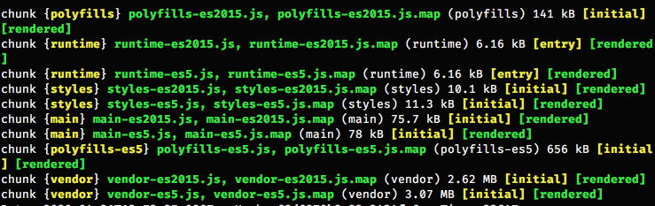

```sh
main es2015: 75.7kb
main es5: 78kb
```

Note: Angular v9.1.1

----

### Bundle sizes with Ivy

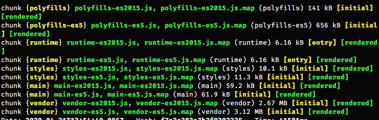

```sh
main es2015: 59.2kb
main es5: 61.9kb
```

----

### Better re-compilation

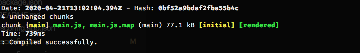

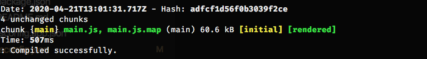


----

### Better debugging (without Ivy)

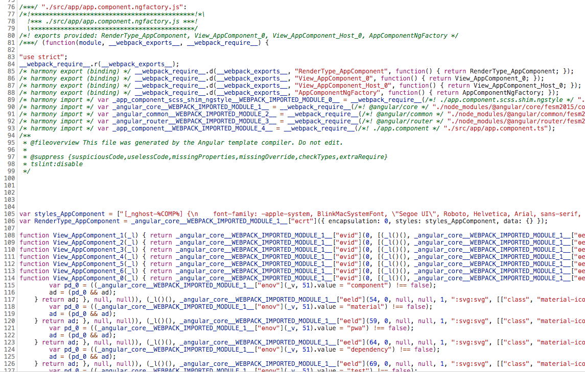

----

### Better debugging with Ivy

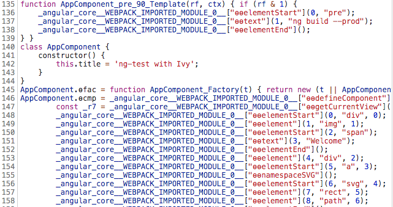

----

### Faster testing

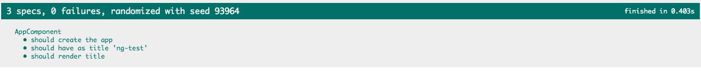
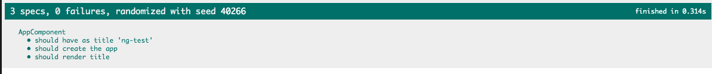

Note: This doesn't seem much, but scales greatly over a larger project.

----

Now by default in new projects, quick setting in tsconfig for existing ones.
```json
  ...,
  "angularCompilerOptions": {
    "enableIvy": true
  },
  ...
``` 

---

# Improved i18n

@angular/localize<!-- .element: class="fragment" -->

`ng add @angular/localize`<!-- .element: class="fragment" -->

https://angular.io/guide/i18n<!-- .element: class="fragment" -->


Note: Make joke about how I'm not really familiar with i18n in my current projects, so...? Ok, I researched it a bit for you!

----

```html
<h1 i18n="meaning|Description for translators@@customId">Hello all!</h1>
```

```sh
ng xi18n
```
<!-- .element: class="fragment" -->

----

```xml
<xliff version="1.2" xmlns="urn:oasis:names:tc:xliff:document:1.2">
  <file source-language="en-US" datatype="plaintext" original="ng2.template">
    <body>
      <trans-unit id="customId" datatype="html">
        <source>Hello all!</source>
        <context-group purpose="location">
          <context context-type="sourcefile">src/app/app.component.html</context>
          <context context-type="linenumber">1</context>
        </context-group>
        <note priority="1" from="description">Description for translators</note>
        <note priority="1" from="meaning">meaning</note>
      </trans-unit>
    </body>
  </file>
</xliff>
```

```xml
<target>Hallo allemaal!</target>
```
<!-- .element: class="fragment" -->

```sh
ng xi18n  --format=xlf
ng xi18n  --format=xlf2
ng xi18n  --format=xmb
```
<!-- .element: class="fragment" -->

Note: 3 formats, XLF, XLF2 and XMB. All "known" translation formats.

----

```html
<span i18n>Updated {minutes, plural, 
  =0 {just now} 
  =1 {one minute ago} 
  other {{{minutes}} minutes ago}}
</span>
```

```xml
<trans-unit id="5420212fa00d960d1c8858ce09b10e0dc5b87d90" datatype="html">
      <source>Updated <x id="ICU" equiv-text="{minutes, plural, =0 {...} =1 {...} other {...}}"/>
      </source>
```
<!-- .element: class="fragment" -->


```xml
<trans-unit id="5a134dee893586d02bffc9611056b9cadf9abfad" datatype="html">
        <source>{VAR_PLURAL, plural, =0 {just now} =1 {one minute ago} other {<x id="INTERPOLATION" equiv-text="{{minutes}}"/> minutes ago} }</source>
</trans-unit>
```
<!-- .element: class="fragment" -->

----

```html
<span i18n>Updated {minutes, plural, 
  =0 {just now} 
  =1 {one minute ago} 
  other {{{minutes}} minutes ago}}
</span>
```

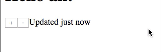<!-- .element: class="fragment" -->


Note: In case you were wondering what this ICU/plural thing does?


----

### i18n is getting powerful!

`ng build --prod --localize`

- Faster building of all bundles<!-- .element: class="fragment" -->
- Still a bundle per locale<!-- .element: class="fragment" -->

<aside class="notes">Still have different bundles for every language. But compilation and building each bundle is now done in seconds or even parallel, taking international builds from 2 minutes to 40 seconds.

Of course many plugins available that do live translations etc. like `ngx-translate`.
</aside>

---

### Angular Core typesafety improvements

```ts
const service = TestBed.get(ExampleService)
service. ??? // any!
```
<!-- .element: class="fragment" -->

```ts
const service = TestBed.inject<ExampleService>(ExampleService)
```
<!-- .element: class="fragment" -->

No auto migration yet!<!-- .element: class="fragment" -->

---

### Testing

----

#### Unit testing

```ts
const radioButton = fixture.debugElement.query(By.css('#radio-button'))
const clickableElement = radio.query(By.css('.mat-radio-container'))

clickableElement.nativeElement.click();
fixture.detectChanges();
fixture.whenStable().then(() => {
  const rows = fixture.debugElement.queryAll(By.css('.mat-table tbody tr'));
  expect(rows.length).toBe(5);
  done()
})
```
<!-- .element: class="fragment" -->

Note: Addition to @angular/material, as a part of Angular CDK. Instead of this with the CSS selectors, the hardcoded #id and .classes, we go to:

----

#### Component Harnasses

```ts
const radioButton = await loader.getHarness<MatRadioButtonHarness>(MatRadioButtonHarness.with({
  label: 'My radio'
}))
const table = await loader.getHarness<MatTableHarness>(MatTableHarness)

await radioButton.check()
const rows = await table.getRows()
expect(rows.length).toBe(5)
```

So clean! 😍<!-- .element: class="fragment" -->


Note: Based on the "PageObject" principe we see a lot, in both Unit and E2E testing in the frontend, @angular/material now adds their own testing helpers called Harnasses. They abstract away the internal implementation details, so we don't have to rely on their internal classes to target our components. You can do this for yourself too!

----

#### E2E testing

Harnasses too with @angular/material and @angular/cdk!
<!-- .element: class="fragment fade-in-then-semi-out" -->

End-to-End tests now support grep and invertGrep
<!-- .element: class="fragment" -->

```ts
ng e2e --grep searchTerm
```
<!-- .element: class="fragment fade-in-then-out" -->

```ts
describe('App', () => {
  it('should display welcome message', () => {}
  it('should test things', () => {}
})
```
<!-- .element: class="fragment" -->

```sh
  ng e2e --grep test  //  Executed 1 of 2 specs
  ng e2e --grep App   // Executed 2 of 2 specs SUCCESS in 1 sec.
```
<!-- .element: class="fragment" -->

Note: Makes targetting a specific e2e test even easier. Zone into a specific test or group of tests, or exclude in the same way.

---

### New compiler defaults

<p class="fragment">Ahead-of-Time</p>
<p class="fragment">Improved type checking of templates</p>
<p class="fragment">ngcc takes care of backwards compatibility</p>

```json
{
  fullTemplateTypeCheck: true, 
  strictTemplates: true
}
```
<!-- .element: class="fragment" -->

Note: AoT is now default in new Angular 9 projects, you can change this in your angular.json. This builds and compiles all your styles and HTML into JavaScript files too for faster rendering on the client. 

This also enables improved type checking of templates, for which we have 2 settings now available in your tsconfig.json.

And the Angular Compatibility Compiler takes care of backwards compatibility for external libraries.

----

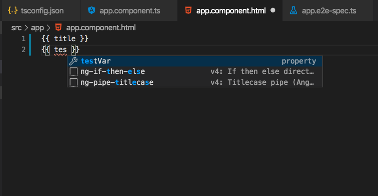
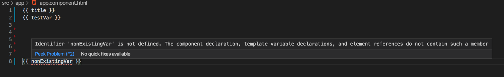

---

### TypeScript  upgrades


<p class="fragment fade-in-then-semi-out visible" data-fragment-index="0">v9: TypeScript 3.7</p>
<p class="fragment fade-in visible" data-fragment-index="1">v9.1: TypeScript 3.8</p>

----

<p class="fragment fade-in-then-semi-out visible" data-fragment-index="2">Optional chaining</p>
<p class="fragment fade-in-then-semi-out visible" data-fragment-index="3">Type-only imports</p>
<p class="fragment fade-in-then-semi-out visible" data-fragment-index="4">ECMAScript private fields</p>
<p class="fragment fade-in-then-semi-out visible" data-fragment-index="5">Top level await</p>
<p class="fragment fade-in-then-semi-out visible" data-fragment-index="6">"fast & loose" incremental checking</p>

https://devblogs.microsoft.com/typescript/announcing-typescript-3-8/<!-- .element: class="fragment" -->

---

### TSLint upgrade

- TSLint 6.1 by default (v9.1)<!-- .element: class="fragment" -->
- No automatic upgrade, cause of breaking changes!<!-- .element: class="fragment" -->

`ng update @angular/cli --migrate-only tslint-version-6`
<!-- .element: class="fragment" -->

---

### DevEx: IDE & Language Service improvements
- Mainly for VSCode<!-- .element: class="fragment fade-in-then-semi-out" -->
- Improved HTML & Expression Syntax Highlighting<!-- .element: class="fragment" -->

---

# Questions?<!-- .element: class="fragment" -->

---

## Thank you!<!-- .element: class="fragment fade-in"-->

<div style="float: left; width: 40%">
  <br />
  
</div>
<div style="float: left; width: 60%; text-align: left;">
<br />
  <h1 style="font-size: 0.9em;">@Bjeaurn</h1>
  <p>Please tweet me your thoughts!</p>
</div>