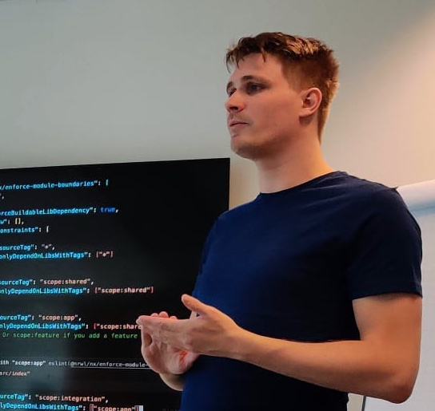

# Back to basics
## Panel discussion<!-- .element: class="fragment" -->

---

<!-- .slide: data-background-image="assets/bgs/pankaj-patel-u2Ru4QBXA5Q-unsplash.jpg" -->

# Welcome!

Note: Welcome to the back to basics panel discussion. Give a little background, it's all HTML/JS/CSS in the end. 

----

<!-- .slide: data-background-image="assets/bgs/angular-vs-react-vs-vue-js-comparing-performance.avif" -->

### Open-minded & constructive discussion

Note: It's okay to differ from opinion, it's okay to change your mind. We know people can get really passionate about their chosen stacks and solutions. We're not here to discuss why you're wrong or right. We're here to discuss whether all this cool tech helps get towards the end goal: Helping our users. We want to debate (unnecessary) complexity and solving problems.

---

## Introductions<!-- .element: class="fragment" -->

---

Bjorn / Almer 

Note: Your hosts for tonight!

---

# The panel<!-- .element: class="fragment" -->

----

Mark / Jorrik / Daria / Rodney

Note: Your panel! Quick intro per person, give them a chance and a minute to introduce themselves. We will be directing all the topics/questions to someone in the panel first.

---

# Discussion<!-- .element: class="fragment" -->

Note: Have a bunch of topics here in a logical order, that allows us to play with the time? Extend where needed?

---

<!-- .slide: data-background-image="assets/bgs/state-of-js-2022-interest.png" -->

<h3>Frontend Development has made huge leaps in the last 10 years.</h3>
<h2>Have these been in favor for the user, or for the developer?</h2>

Note: The "kick-the-door open" intro. We've come so far, but have we lost sight of the user? Have all these technical advances helped the user?

----

## Frontend Development is unnecessarily complex

Note: Why not use some HTML, CSS and jQuery?

----

## Is learning Frontend more difficult then 5 years ago?
### What about 10 years?

Note: Trying to get a Junior's perspective in here, is the frontend landscape too daunting? Where to begin? (5y: R/V/A, jQ, Bootstrap, 10y: jQ, Knockout, Backbone, Ember, AngularJS)

----

## TypeScript unnecessarily complicates your codebase and slows down teams.

Note: Although TypeScript is probably "required" for big projects spanning multiple teams and years, does it initially slow down projects?

----

## What is the current trend in the Frontend? 
### Which frameworks/styles/paradigms?

Note: SSR, SSG, Web Apps, Microfrontends, JAMstack, full client apps, etc.

---

<!-- .slide: data-background-image="assets/bgs/carlos-muza-hpjSkU2UYSU-unsplash.jpg" -->

<h2 style="background: rgba(0,0,0,.6);">When should you go for a web app?</h2>

Note: With all the SSR and SSG solutions coming out, trying to ship as little JS to the browser as possible. What rules can we define for when you should create a web app and when you should create a more "static site"? What level of interaction, how do we measure that?

----

### Is the gap between Interface and UX design and Frontend "Engineering" bigger than Frontend and Backend engineering?

Note: Is there more different types of skills required for one or the other? Is frontend engineering a lot closer to backend engineering than we'd think? What roles do we define within Frontend Development? What "Expertise" areas do we acknowledge? Think about the popularity of Bootstrap/Tailwind and all the Design System component libraries like Shadcn/ui, material, bootstrap, ANT.

----

## Should frontend devs go back to more fullstack profiles?

Note: CICD, Backend / REST / Basic databases?, Authentication/Authorization, Basic containerization, deployments, Nginx/Apache, etc.?, HTTP/2, Browser engine differences, Websockets, etc. 

----

### Is the current obsession with performance optimization and web accessibility standards hindering creativity and innovation in frontend development?

Note: Or is there enough "obsession" for web a11y? Is there enough room for creativity still? When is the last time you saw a really creative site or app?

---

<!-- .slide: data-background-image="assets/bgs/headway-5QgIuuBxKwM-unsplash.jpg" -->

<h3 style="background: rgba(0,0,0,0.5);">How can we balance the need for quick development and time-to-market with maintaining clean and maintainable code in frontend projects?</h3>

Note: This one is relevant to reflect on *our* day to day job and how it affects our clients.

----

### Has the demand for "pixel-perfect" designs in frontend development become unrealistic and detrimental to project timelines?

Note: Are we in a niche that we may not have this problem? Is this niche growing or shrinking?

---

## Conclusions

Note: Final remarks, from the audience, from the panel?

----

## Thanks for attending
### See you next time!<!-- .element: class="fragment" -->

Enjoy a drink in the Plaza<!-- .element: class="fragment" -->